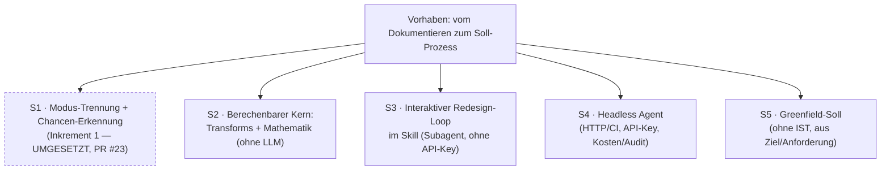

# Vom Dokumentieren zum Soll-Prozess — Prozess-Optimierung im BPMN-Generator

> SoT des VORHABENS. Das Design-Dokument (Spec) ist die Lösungs-Projektion einer einzelnen
> Scheibe und wird aus diesem Record heraus geprüft — nicht umgekehrt.

## Prüf-Sicht

> Abgeleitete Sicht — **kein** neuer SoT, **kein** Gütesiegel. **Offenes zuerst**, keine Ampeln,
> jede Zahl verweist auf ihren Beleg im Record.

| Prüf-Ziel | Stand (offen → belegt) | → Beleg |
|---|---|---|
| **Enthaltsamkeit** (was offen?) | 4 offene Punkte · 3 Scheiben geparkt (mit Trigger/Owner) | ↓ Offene Punkte · Split |
| **Abdeckung** (Säulen + vergessene Pfade) | 7/7 Säulen belegt · 0 Opt-Out · **Negations-Achse: offen** | ↓ Saeulen |
| **Belegtheit** (Quellen) | 7 Verifiziert · 0 Hypothese — davon 4 auf Sitzungs-Entscheidungen, 3 auf Code/Repo-Befunden; externe Recherche steht aus (Phase 3) | ↓ Saeulen-Quellen |
| **Prüf-Durchdringung** (testbar) | 0 Gherkin-Szenarien — Phase 4 | ↓ Akzeptanzkriterien |
| **Integrität** (Prozess) | GATE 1 **bestanden** (2026-07-24) · GATE 2a/2b offen · Lern-Spur gepflegt | ↓ Lern-Spur |

## Herkunft

- **Quelle:** Arbeitssitzung 2026-07-24, Dialog im Anschluss an den Merge von Inkrement 1
  (Optimization Advisory, PR #23). Kein externes Dokument — Synthese aus dem Gespräch.
- **Wortlaut-Original (Audit-Anker, NIE überschreiben):**
  > „wir brauchen da wohl unterschiedliche modi. wenn jemand einen prozess beschreibt und denn als
  > bpmn sehen will ist das eine sache. wenn aber jemand einen sollprozess benötigt, dann wäre das
  > was oder?"
  >
  > „kann man das irgendwie wrappen und so weit es geht einen frei defienierbaren agenten machen
  > lassen?"
  >
  > „also die sachen die ohne funktionen oder alghorytmen noch laufen müssen. wenn es mathematische
  > dafür gibt gerne auch die"
  >
  > (Soll-Szenario) „sowohl bestenden ist als auch greenfield sind realistische szenarien" ·
  > (Output) „Interaktiv redesignen" · (Umfang) „wir sollten das ganze projekt aufnehmen was wir
  > vorhaben"
- **Kanonisierte Formulierung:** Der BPMN-Generator soll Prozesse nicht nur **abbilden**, sondern
  helfen, sie **besser zu machen** — mit klarer Trennung beider Aufträge. Alles Berechenbare
  (inklusive vorhandener mathematischer Verfahren) gehört in deterministische Funktionen; nur der
  Rest läuft über einen frei definierbaren Agenten, der so weit wie möglich selbständig arbeitet.

## Die Idee dahinter

Ein BPMN-Werkzeug, das nur zeichnet, hält den Ist-Zustand fest — es verändert nichts. Der eigentliche
Wert von Prozessarbeit entsteht aber beim **Verbessern**. Die Idee ist, beides sauber zu trennen und
beides zu können:

- **Dokumentieren** — ich beschreibe einen Prozess und bekomme ihn **getreu** als BPMN. Kein Urteil,
  keine ungefragten Ratschläge im Modell.
- **Soll erarbeiten** — ich brauche einen **besseren** Prozess und bekomme Vorschläge, die auf
  publizierter Redesign-Forschung beruhen, kann sie annehmen oder ablehnen, und erhalte am Ende ein
  Soll-Modell neben dem IST.

Der Kniff ist die **Arbeitsteilung**: Was sich berechnen lässt (Erkennung, Graph-Umbau, Soundness,
Kennzahlen, Reihenfolge-Optimierung), wird berechnet — deterministisch, testbar, ohne LLM. Nur was
sich *nicht* berechnen lässt (Ist das fachlich sinnvoll? Welches Ziel wiegt schwerer?), übernimmt ein
Agent, dessen Grenzen man selbst definiert.

## Der Nutzen

- **Für den BA/Berater:** Verbesserungsideen müssen nicht mehr von Hand ins Modell übersetzt werden.
  Der Weg von „hier klemmt etwas" zum belegten Soll-Vorschlag verkürzt sich erheblich.
- **Für die Qualität der Vorschläge:** Sie stammen nicht aus dem Bauch eines Sprachmodells, sondern
  aus veröffentlichten Redesign-Heuristiken — und werden gegen die vorhandene Soundness-Prüfung
  validiert. Was nicht berechenbar ist, wird als Einschätzung **gekennzeichnet**, nicht als Fakt
  verkauft.
- **Für die Nachvollziehbarkeit:** IST bleibt erhalten, jede Änderung steht mit Begründung im
  Changelog. Ein Soll-Vorschlag ist damit diskutierbar statt nur „vom Tool erzeugt".
- **Für regulierte Umgebungen:** Der berechenbare Kern läuft ohne LLM und ohne API-Key; wo ein Modell
  nötig ist, funktioniert auch ein lokales.

## Rationale (normativ — Freigabe durch den Menschen, GATE 1)

> **Status: FREIGEGEBEN am 2026-07-24 durch Daniel Stiegler (GATE 1).** Verbindliche Grundlage für
> Phase 3/4. Mit freigegeben: das Erfolgskriterium für S2 (ein Eingriff liefert ein soundness-valides
> Modell, verändert nur das Beabsichtigte, ist ohne Sprachmodell reproduzierbar).

Inkrement 1 erkennt Redesign-Chancen, kann sie aber nur **melden**. Der fachliche Wert entsteht erst,
wenn daraus ein Soll-Prozess wird. Zwei Gründe tragen das Vorhaben:

1. **Dokumentieren und Optimieren sind verschiedene Aufträge.** Wer einen IST-Prozess festhalten will,
   darf keine ungefragten Verbesserungen im Modell bekommen. Ohne saubere Trennung wird das Werkzeug
   für beide Zwecke unbrauchbar.
2. **Ein Sprachmodell allein ist für Prozess-Redesign nicht belastbar genug.** Graph-Umbauten müssen
   korrekt und nachvollziehbar sein. Daher die Arbeitsteilung: Berechenbares deterministisch und
   testbar; Urteilsabhängiges an eine Instanz, deren Grenzen konfigurierbar sind — und deren Ergebnis
   gegen die vorhandene Soundness-Prüfung läuft.

**Warum S2 (Werkzeugkasten) zuerst:** Alle weiteren Scheiben setzen darauf auf — ohne benannte,
geprüfte Eingriffe hat weder ein Loop noch ein Agent etwas anzuwenden. S2 ist zugleich die Scheibe mit
dem geringsten Risiko und der höchsten Prüfbarkeit (deterministisch, ohne Sprachmodell, ohne API-Key,
vollständig testbar) und bereits allein nutzbar, bevor irgendeine Automatik existiert.

## Split / Scheiben (TORE-Split-Gate)

Das Vorhaben spannt mehrere TORE-Ebenen (Ziel · Domäne · Interaktion · System) und ist deshalb **keine
atomare Anforderung**. Der Denkrahmen verlangt hier zuerst den Split; detailliert wird **eine** Scheibe.

| Scheibe | TORE | Inhalt | Stand |
|---|---|---|---|
| **S1** | system | Modi `document`/`optimize`, Erkennung O01–O04, Lean-Kennzahlen | **umgesetzt** (PR #23) |
| **S2** | system | Werkzeugkasten: benannte Prozess-Eingriffe + Rechenteil, ohne Sprachmodell | ► **DIESES RECORD** |
| **S3** | interaction | Vorschlagen → annehmen/ablehnen → umbauen → neu rendern; IST↔Soll + Changelog | geparkt |
| **S4** | system | Gleiche Fähigkeit headless für HTTP/CI; Key-Hygiene, Kostendeckel, Audit | geparkt |
| **S5** | domain | Soll ohne IST: aus Ziel/Anforderung einen Erstentwurf bauen | geparkt |

### Geparkte Scheiben (Disposition mit Trigger + Owner)

Nicht fallengelassen, nicht mitdetailliert. Jede wird bei Aufgriff ein **eigener Record** mit eigenem
Säulen-Walk.

| Scheibe | Trigger (was löst den Aufgriff aus) | Owner |
|---|---|---|
| **S3** Interaktiver Loop | S2 umgesetzt, getestet und an echten Prozessen erprobt | Daniel Stiegler |
| **S4** Headless Agent | S3 bewährt **und** konkreter Bedarf aus HTTP/CI-Nutzung | Daniel Stiegler |
| **S5** Greenfield-Soll | S3 steht (der Loop ist die Zielumgebung für den Erstentwurf) | Daniel Stiegler |

**Gewählte Scheibe: S2 — Werkzeugkasten.** Begründung: Voraussetzung für S3–S5, unabhängig davon
nutzbar und vollständig testbar, und ohne Sprachmodell/API-Key betreibbar.

## Saeulen (Befund ODER begründeter Opt-Out)

> **Split-Gate hält an.** Die 7 Säulen werden für die **gewählte Scheibe** erarbeitet, nicht für das
> Gesamtvorhaben — sonst entsteht ein nicht umsetzbarer Sammel-Record.

> Erarbeitet für die **gewählte Scheibe S2** (Werkzeugkasten), nicht für das Gesamtvorhaben.

| Saeule | Befund / Opt-Out | Status | Quelle |
|---|---|---|---|
| **business_intent** | **Idee:** ein benannter, nachvollziehbarer Werkzeugkasten für Prozess-Eingriffe — die Grundlage, um aus erkannten Chancen echte Soll-Modelle zu machen. **Nutzen:** Verbesserungen müssen nicht mehr von Hand ins Modell übersetzt werden; jeder Eingriff ist benennbar, geprüft und umkehrbar (IST bleibt). **Priorität `muss`** — S3–S5 setzen alle auf S2 auf; ohne den Kern bleibt Inkrement 1 bei reinen Meldungen stehen. *(Bestätigung an GATE 1.)* | Verifiziert | Wortlaut-Original; Sitzung 2026-07-24 |
| **user_ux** | Zwei Zugänge: **Programmierschnittstelle** für die späteren Scheiben **und** ein schlanker **Kommandozeilen-Zugang**, mit dem ein Mensch einen Eingriff gezielt auf eine Datei anwendet. Damit ist S2 ohne S3 erprobbar. | Verifiziert | Entscheidung Sitzung 2026-07-24 |
| **functional** | **Alle fünf Eingriffe** im ersten Wurf: Nebeneinanderlegen · Ausnahme herausnehmen · Prüfreihenfolge drehen · Schritte bündeln · Rolle wechseln. Dazu der **Rechenteil**: Reihenfolge-Optimierung, Unabhängigkeits-Prüfung (nur bei modellierten Datenflüssen beweisbar), Durchlaufzeit, Bewertung nach Zeit/Kosten/Qualität/Flexibilität. **S2 entscheidet nie, *ob* ein Eingriff gemacht wird** — kein Ziel, kein Urteil, kein Sprachmodell. | Verifiziert | Entscheidung Sitzung 2026-07-24; Spec §4/§5 |
| **quality_attributes** | **Sicherheitszusage:** nach jedem Eingriff Soundness-Prüfung; **strukturelle Fehler rollen den Eingriff zurück**, neue **Warnungen blockieren nicht, werden aber im Ergebnis gemeldet**. Determinismus: gleiche Eingabe + gleiche Parameter ⇒ gleiches Ergebnis (Voraussetzung für Golden-Tests). Reine Funktionen, keine Seiteneffekte, kein Netzzugriff. | Verifiziert | Entscheidung Sitzung 2026-07-24 |
| **compliance** | **Kein Datenabfluss:** S2 läuft vollständig lokal, ohne Sprachmodell und ohne API-Key — geprüft: der CLI-/Pipeline-Pfad importiert heute keinen LLM-Provider. Relevant für regulierte Umgebungen, in denen Prozessmodelle das Haus nicht verlassen dürfen. **Herkunft der Verfahren:** ausschließlich publizierte Quellen (Reijers/Limam Mansar 2005; BABOK v3 §10.34); keine internen Materialien im öffentlichen MIT-Repo. **Kein Personenbezug** im Werkzeug selbst; Lane-Namen sind laut Konvention funktionale Rollen, keine Personennamen. | Verifiziert | `scripts/pipeline.js` (kein LLM-Import); SECURITY.md; SKILL.md (Rollen statt Namen) |
| **architecture** | Zwei neue Module: Eingriffe und Rechenteil, als **reine Funktionen** Logic-Core → Logic-Core. Anschluss an die vorhandene Erkennung (Inkrement 1) und an die vorhandene Soundness-Prüfung. **Verbindliche Grenze:** der berechenbare Kern importiert **nie** den LLM-Provider — Austausch oder Wegfall der Urteilsschicht darf ihn nicht brechen. Schutz-Listen (unantastbare Bahnen/Schritte) werden **im Eingriff selbst** durchgesetzt, nicht per Prompt. | Verifiziert | Spec §3/§8; `scripts/rules.js`, `scripts/optimize.js` |
| **migration_operations** | **Umstellung:** `advisories` wird von Texten auf **Objekte** umgestellt (lesbare Meldung bleibt als Feld enthalten), dokumentiert als bewusste Vertragsänderung — das Feld ist einen Tag alt (PR #23) und hat praktisch keine Nutzer. Sonst **additiv**: `document`-Modus unverändert, Golden-Dateien unberührt, keine Datenmigration. Rückrollbarkeit: S2 ist opt-in und ändert nichts am bestehenden Verhalten. | Verifiziert | Entscheidung Sitzung 2026-07-24; `references/api-reference.md` (aktueller Vertrag) |

## Akzeptanzkriterien (Gherkin — ab reifegrad: formalized)

> Phase 4, nach Scheiben-Wahl und Säulen-Walk.

## Offene Punkte

> Nur tatsächlich Ungeklärtes. Die nicht gewählten Scheiben stehen **nicht** hier — sie sind im Split
> mit Trigger + Owner disponiert.

- ~~GATE 1~~ — **bestanden 2026-07-24**; Rationale + Erfolgskriterium freigegeben.
- **Negations-Achse (§6a) noch nicht gestellt** — pro Eingriff fehlt die Frage „Was verhindert,
  negiert oder unterbricht ihn?" (Ablehnung · Abbruch · Timeout · Teil-Erfüllung).
  *Disposition: in Phase 4 je Eingriff als Szenario oder begründeter Opt-Out.*
- **Erfolgskriterium noch nicht bestätigt** — Entwurf: ein Eingriff liefert ein soundness-valides
  Modell, verändert nur das Beabsichtigte und ist ohne Sprachmodell reproduzierbar.
  *Disposition: an GATE 1 mitbestätigen.*
- **Externe Recherche steht aus (Phase 3)** — die mathematischen Verfahren (Reihenfolge-Optimierung,
  Unabhängigkeit, kritischer Pfad) sind bisher aus dem Spec übernommen, nicht gegen die publizierten
  Quellen nachgeprüft. *Disposition: Phase-3-Recherche mit Quellenangabe je Befund.*

## Lern-Spur

- 2026-07-24 · REIFEGRAD · Record · — → raw · Arbeitssitzung, Anwendung des Anforderungs-Denkrahmens
- 2026-07-24 · ERGAENZUNG · Umfang · Einzel-Inkrement → Gesamtvorhaben mit 5 Scheiben · Nutzer:
  „wir sollten das ganze projekt aufnehmen was wir vorhaben"
- 2026-07-24 · PRAEZISIERUNG · business_intent · MoSCoW-Frage zuerst → Idee und Nutzen zuerst · Nutzer:
  „statt business intent die idee dahinter. den nutzen"
- 2026-07-24 · ERGAENZUNG · Split · Scheiben S3–S5 undisponiert → geparkt mit Trigger + Owner · Nutzer:
  „und was ist mit den scheiben die wir nicht wählen?"
- 2026-07-24 · REIFEGRAD · Record · raw → structured · Scheibe S2 gewählt, 7/7 Säulen belegt
  (user_ux · functional · quality_attributes · migration_operations als Sitzungs-Entscheidungen)
- 2026-07-24 · ERGAENZUNG · Rationale · beim Umschreiben auf das Gesamtvorhaben verloren → als eigener
  normativer Abschnitt wiederhergestellt · Selbstprüfung vor GATE 1
- 2026-07-24 · REIFEGRAD · GATE 1 · offen → bestanden · Rationale + Erfolgskriterium durch
  Daniel Stiegler freigegeben

---

**Methodik-Hinweis:** Dieser Record folgt einem Anforderungs-Denkrahmen auf publizierten Grundlagen:
ISO/IEC/IEEE 29148 (Requirements Engineering), IREB CPRE, TORE (Task-and-Object-oriented Requirements
Engineering) und BDD/Gherkin als Verifikations-Vertrag.
