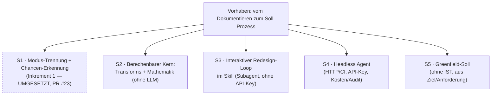

# Vom Dokumentieren zum Soll-Prozess — Prozess-Optimierung im BPMN-Generator

> SoT des VORHABENS. Das Design-Dokument (Spec) ist die Lösungs-Projektion einer einzelnen
> Scheibe und wird aus diesem Record heraus geprüft — nicht umgekehrt.

## Prüf-Sicht

> Abgeleitete Sicht — **kein** neuer SoT, **kein** Gütesiegel. **Offenes zuerst**, keine Ampeln,
> jede Zahl verweist auf ihren Beleg im Record.

| Prüf-Ziel | Stand (offen → belegt) | → Beleg |
|---|---|---|
| **Enthaltsamkeit** (was offen?) | 5 geparkte Punkte (Rechenteil-Verfahren · CPM · Bewertung · Laufzeitschranke · S2-Teilung) · 3 Scheiben geparkt — alle mit Trigger/Owner | ↓ Offene Punkte · Split |
| **Abdeckung** (Säulen + vergessene Pfade) | 9 Säulen-Zeilen (7 Säulen, `functional` dreigeteilt) · 1 begründeter Opt-Out (Timeout/Warten) · **Negations-Achse: je Eingriff gestellt**, 6 transformspezifische Fehlermodi nachgetragen | ↓ Saeulen · Negations-Achse |
| **Belegtheit** (Quellen) | **6 Verifiziert · 1 Hypothese · 1 Nicht gefunden** (Datenlage) · 1 eingeschränkt. **4 Demotionen** und **3 Quellenkorrekturen** durch GATE 2b; die Kein-LLM-Zusage wurde unabhängig an der Import-Hülle nachgerechnet | ↓ Saeulen-Quellen · Lern-Spur |
| **Prüf-Durchdringung** (testbar) | **13 aktive Szenarien** (1 geparkt: Teil-Erfüllung) · **umgesetzt in 472 Tests**, davon 126 für den Werkzeugkasten · nicht testbar → Inspection (Import-Grenze, per transitiver Hülle geprüft: 8 Module, kein LLM) | ↓ Akzeptanzkriterien |
| **Integrität** (Prozess) | GATE 1 **bestanden** · GATE 2a **gelaufen** (12 Befunde, alle disponiert) · GATE 2b **gelaufen** (4 Demotionen, 3 Quellenkorrekturen, 1 Faktenkorrektur) · Lern-Spur gepflegt | ↓ Lern-Spur |

## Herkunft

- **Quelle:** Arbeitssitzung 2026-07-24, Dialog im Anschluss an den Merge von Inkrement 1
  (Optimization Advisory, PR #23). Kein externes Dokument — Synthese aus dem Gespräch.
- **Wortlaut-Original (Audit-Anker, NIE überschreiben):**
  > „wir brauchen da wohl unterschiedliche modi. wenn jemand einen prozess beschreibt und denn als
  > bpmn sehen will ist das eine sache. wenn aber jemand einen sollprozess benötigt, dann wäre das
  > was oder?"
  >
  > „kann man das irgendwie wrappen und so weit es geht einen frei defienierbaren agenten machen
  > lassen?"
  >
  > „also die sachen die ohne funktionen oder alghorytmen noch laufen müssen. wenn es mathematische
  > dafür gibt gerne auch die"
  >
  > (Soll-Szenario) „sowohl bestenden ist als auch greenfield sind realistische szenarien" ·
  > (Output) „Interaktiv redesignen" · (Umfang) „wir sollten das ganze projekt aufnehmen was wir
  > vorhaben"
- **Kanonisierte Formulierung:** Der BPMN-Generator soll Prozesse nicht nur **abbilden**, sondern
  helfen, sie **besser zu machen** — mit klarer Trennung beider Aufträge. Alles Berechenbare
  (inklusive vorhandener mathematischer Verfahren) gehört in deterministische Funktionen; nur der
  Rest läuft über einen frei definierbaren Agenten, der so weit wie möglich selbständig arbeitet.

## Die Idee dahinter

Ein BPMN-Werkzeug, das nur zeichnet, hält den Ist-Zustand fest — es verändert nichts. Der eigentliche
Wert von Prozessarbeit entsteht aber beim **Verbessern**. Die Idee ist, beides sauber zu trennen und
beides zu können:

- **Dokumentieren** — ich beschreibe einen Prozess und bekomme ihn **getreu** als BPMN. Kein Urteil,
  keine ungefragten Ratschläge im Modell.
- **Soll erarbeiten** — ich brauche einen **besseren** Prozess und bekomme Vorschläge, die auf
  publizierter Redesign-Forschung beruhen, kann sie annehmen oder ablehnen, und erhalte am Ende ein
  Soll-Modell neben dem IST.

Der Kniff ist die **Arbeitsteilung**: Was sich berechnen lässt (Erkennung, Graph-Umbau, Soundness,
Kennzahlen, Reihenfolge-Optimierung), wird berechnet — deterministisch, testbar, ohne LLM. Nur was
sich *nicht* berechnen lässt (Ist das fachlich sinnvoll? Welches Ziel wiegt schwerer?), übernimmt ein
Agent, dessen Grenzen man selbst definiert.

## Der Nutzen

- **Für den BA/Berater:** Verbesserungsideen müssen nicht mehr von Hand ins Modell übersetzt werden.
  Der Weg von „hier klemmt etwas" zum belegten Soll-Vorschlag verkürzt sich erheblich.
- **Für die Qualität der Vorschläge:** Sie stammen nicht aus dem Bauch eines Sprachmodells, sondern
  aus veröffentlichten Redesign-Heuristiken — und werden gegen die vorhandene Soundness-Prüfung
  validiert. Was nicht berechenbar ist, wird als Einschätzung **gekennzeichnet**, nicht als Fakt
  verkauft.
- **Für die Nachvollziehbarkeit:** IST bleibt erhalten, jede Änderung steht mit Begründung im
  Changelog. Ein Soll-Vorschlag ist damit diskutierbar statt nur „vom Tool erzeugt".
- **Für regulierte Umgebungen:** Der berechenbare Kern läuft ohne LLM und ohne API-Key; wo ein Modell
  nötig ist, funktioniert auch ein lokales.

## Rationale (normativ — Freigabe durch den Menschen, GATE 1)

> **Status: FREIGEGEBEN am 2026-07-24 durch Daniel Stiegler (GATE 1).** Verbindliche Grundlage für
> Phase 3/4. Mit freigegeben: das Erfolgskriterium für S2 (ein Eingriff liefert ein soundness-valides
> Modell, verändert nur das Beabsichtigte, ist ohne Sprachmodell reproduzierbar).

Inkrement 1 erkennt Redesign-Chancen, kann sie aber nur **melden**. Der fachliche Wert entsteht erst,
wenn daraus ein Soll-Prozess wird. Zwei Gründe tragen das Vorhaben:

1. **Dokumentieren und Optimieren sind verschiedene Aufträge.** Wer einen IST-Prozess festhalten will,
   darf keine ungefragten Verbesserungen im Modell bekommen. Ohne saubere Trennung wird das Werkzeug
   für beide Zwecke unbrauchbar.
2. **Ein Sprachmodell allein ist für Prozess-Redesign nicht belastbar genug.** Graph-Umbauten müssen
   korrekt und nachvollziehbar sein. Daher die Arbeitsteilung: Berechenbares deterministisch und
   testbar; Urteilsabhängiges an eine Instanz, deren Grenzen konfigurierbar sind — und deren Ergebnis
   gegen die vorhandene Soundness-Prüfung läuft.

**Warum S2 (Werkzeugkasten) zuerst:** Alle weiteren Scheiben setzen darauf auf — ohne benannte,
geprüfte Eingriffe hat weder ein Loop noch ein Agent etwas anzuwenden. S2 ist zugleich die Scheibe mit
dem geringsten Risiko und der höchsten Prüfbarkeit (deterministisch, ohne Sprachmodell, ohne API-Key,
vollständig testbar) und bereits allein nutzbar, bevor irgendeine Automatik existiert.

## Split / Scheiben (TORE-Split-Gate)

Das Vorhaben spannt mehrere TORE-Ebenen (Ziel · Domäne · Interaktion · System) und ist deshalb **keine
atomare Anforderung**. Der Denkrahmen verlangt hier zuerst den Split; detailliert wird **eine** Scheibe.



| Scheibe | TORE | Inhalt | Stand |
|---|---|---|---|
| **S1** | system | Modi `document`/`optimize`, Erkennung O01–O04, Lean-Kennzahlen | **umgesetzt** (PR #23) |
| **S2** | system | Werkzeugkasten: benannte Prozess-Eingriffe + Rechenteil, ohne Sprachmodell | ► **DIESES RECORD** |
| **S3** | interaction | Vorschlagen → annehmen/ablehnen → umbauen → neu rendern; IST↔Soll + Changelog | geparkt |
| **S4** | system | Gleiche Fähigkeit headless für HTTP/CI; Key-Hygiene, Kostendeckel, Audit | geparkt |
| **S5** | domain | Soll ohne IST: aus Ziel/Anforderung einen Erstentwurf bauen | geparkt |

### Geparkte Scheiben (Disposition mit Trigger + Owner)

Nicht fallengelassen, nicht mitdetailliert. Jede wird bei Aufgriff ein **eigener Record** mit eigenem
Säulen-Walk.

| Scheibe | Trigger (was löst den Aufgriff aus) | Owner |
|---|---|---|
| **S3** Interaktiver Loop | S2 umgesetzt, getestet und an echten Prozessen erprobt | Daniel Stiegler |
| **S4** Headless Agent | S3 bewährt **und** konkreter Bedarf aus HTTP/CI-Nutzung | Daniel Stiegler |
| **S5** Greenfield-Soll | S3 steht (der Loop ist die Zielumgebung für den Erstentwurf) | Daniel Stiegler |

**Gewählte Scheibe: S2 — Werkzeugkasten.** Begründung: Voraussetzung für S3–S5, unabhängig davon
nutzbar und vollständig testbar, und ohne Sprachmodell/API-Key betreibbar.

## Saeulen (Befund ODER begründeter Opt-Out)

> **Split-Gate hält an.** Die 7 Säulen werden für die **gewählte Scheibe** erarbeitet, nicht für das
> Gesamtvorhaben — sonst entsteht ein nicht umsetzbarer Sammel-Record.

> Erarbeitet für die **gewählte Scheibe S2** (Werkzeugkasten), nicht für das Gesamtvorhaben.

| Saeule | Befund / Opt-Out | Status | Quelle |
|---|---|---|---|
| **business_intent** | **Idee:** ein benannter, nachvollziehbarer Werkzeugkasten für Prozess-Eingriffe — die Grundlage, um aus erkannten Chancen echte Soll-Modelle zu machen. **Nutzen:** Verbesserungen müssen nicht mehr von Hand ins Modell übersetzt werden; jeder Eingriff ist benennbar, geprüft und umkehrbar (IST bleibt). **Priorität `muss`** — S3–S5 setzen alle auf S2 auf; ohne den Kern bleibt Inkrement 1 bei reinen Meldungen stehen. *(Bestätigung an GATE 1.)* | Verifiziert | Wortlaut-Original; Sitzung 2026-07-24 |
| **user_ux** | Zwei Zugänge: **Programmierschnittstelle** für die späteren Scheiben **und** ein schlanker **Kommandozeilen-Zugang**, mit dem ein Mensch einen Eingriff gezielt auf eine Datei anwendet. Damit ist S2 ohne S3 erprobbar. | Verifiziert | Entscheidung Sitzung 2026-07-24 |
| **functional** | **Alle fünf Eingriffe** im ersten Wurf: Nebeneinanderlegen · Ausnahme herausnehmen · Prüfreihenfolge drehen · Schritte bündeln · Rolle wechseln. Jeder mit **zwei Funktionen**: `prüfen` (was wäre machbar) und `anwenden` (mit gewähltem Umfang). **S2 entscheidet nie, *ob* ein Eingriff gemacht wird** — kein Ziel, kein Urteil, kein Sprachmodell. | Verifiziert | Entscheidung Sitzung 2026-07-24; Spec §4 |
| **functional — Rechenteil** | **Reihenfolge-Anwendung** (die Reihenfolge wird **übergeben**, nicht als optimal berechnet) · **Unabhängigkeits-Prüfung** nur bei modellierten, **gerichteten** Datenflüssen · **Kennzahl-Delta** vor/nach einem Eingriff. | **Hypothese** | GATE 2b: die zugrundeliegenden Verfahren (Knock-out-Optimalität, Antiketten/Dilworth) sind **nicht** quellengeprüft; eigenes Design-Dokument ist kein Beleg für eine Weltaussage |
| **functional — geparkt** | **Durchlaufzeit (CPM)** und **gewichtete Bewertung (Zeit/Kosten/Qualität/Flexibilität)** gehören **nicht** in S2. CPM ist auf Logic-Core nicht rechenbar (keine Dauern im Schema); Gewichte sind Zielpriorisierung und widersprächen „S2 hat kein Ziel". | **Nicht gefunden** (Datenlage) | GATE 2a §6a/6b; `references/input-schema.json` trägt keine Dauer-/Aufwandsfelder |
| **quality_attributes** | **Sicherheitszusage:** nach jedem Eingriff Prüfung gegen eine **fest benannte Regelmenge** (Soundness-Schicht **inkl. Workflow-Netz**) — **profilunabhängig**, damit das Rollback-Verhalten nicht vom Nutzerprofil abhängt. Verstoß dagegen ⇒ **Rollback**; Stil-Verstöße blockieren nie, werden aber gemeldet. Determinismus: gleiche Eingabe + gleiche Parameter ⇒ gleiches Ergebnis (auch neue IDs deterministisch). Reine Funktionen: das **übergebene Modell wird nicht mutiert**, kein Netzzugriff. | Verifiziert | Entscheidung Sitzung 2026-07-24; **korrigiert nach GATE 2a §2** (WF-Netz ist im Default-Profil aus; strict-Profil macht Stil zu Fehlern) |
| **compliance** | **Kein Datenabfluss** (Zusage für S2, verifizierter Ist-Zustand für den heutigen Pfad): die transitive Import-Hülle von `scripts/pipeline.js` (17 Module) enthält **kein** `agents/llm-provider.js`, auch nicht dynamisch. Relevant für regulierte Umgebungen. **Herkunft der Verfahren:** als Quellen **zitiert** werden ausschließlich publizierte Arbeiten (Reijers & Limam Mansar 2005, *Omega* 33(4):283–306, DOI 10.1016/j.omega.2004.04.012 — bibliographisch bestätigt; BABOK v3 §10.34 — **ungeprüft**). Inhaltliche Deckung ist **nicht** geprüft (Recherche abgebrochen). Keine internen Materialien im öffentlichen MIT-Repo. **Kein Personenbezug** im Werkzeug; Lane-Namen sind laut Konvention funktionale Rollen — **technisch nicht erzwungen** (keine Regel prüft das). | Verifiziert (Import-Befund) / eingeschränkt (Herkunft) | Import-Hülle `scripts/pipeline.js`; `scripts/optimize.js:6-12`; `SKILL.md:157`. **GATE 2b: `SECURITY.md` als Beleg gestrichen** — trägt die Aussage nicht |
| **architecture** | Zwei neue Module: Eingriffe und Rechenteil, als **reine Funktionen** Logic-Core → Logic-Core. Anschluss an die vorhandene Erkennung (Inkrement 1) und an die vorhandene Soundness-Prüfung. **Verbindliche Grenze:** der berechenbare Kern importiert **nie** den LLM-Provider — Austausch oder Wegfall der Urteilsschicht darf ihn nicht brechen. Schutz-Listen (unantastbare Bahnen/Schritte) werden **im Eingriff selbst** durchgesetzt, nicht per Prompt. | Verifiziert | Spec §3/§8; `scripts/rules.js`, `scripts/optimize.js` |
| **migration_operations** | **Zweck der Umstellung:** ein Eingriff muss adressierbar sein — Advisories brauchen `targets` (welche Knoten) + `transform` (welcher Eingriff). **Umstellung:** `advisories` von Texten auf **Objekte** mit **verpflichtendem `message`-Feld**. **KORREKTUR (GATE 2a §1):** Die frühere Begründung „keine Nutzer" war **falsch** — es existieren **mindestens sechs Konsumenten**: `scripts/pipeline.js:388` (CLI-Ausgabe), fünf Assertions in `scripts/pipeline.test.js`, `scripts/mcp-bpmn-server.js:110`, `references/api-reference.md`, `SKILL.md`, `scripts/http-server.test.js`. Die Umstellung **muss** daher: CLI-Ausgabe lesbar halten (über `message`), die fünf Tests migrieren, die MCP-/HTTP-Antwortform dokumentieren. Sonst **additiv**: `document`-Modus unverändert, Golden-Dateien unberührt, keine Datenmigration (als Akzeptanzbedingung, nicht als festgestellte Eigenschaft). | Verifiziert (Konsumentenliste am Code) | GATE 2a §1; heutiger Elementtyp: `scripts/optimize.js:178` (**nicht** api-reference — dort steht kein Elementtyp) |

## Negations-Achse (§6a — je Eingriff, mit Disposition)

> Leitfrage je Eingriff: „Was verhindert, negiert oder unterbricht ihn?" Kein Befund bleibt undisponiert.

| Fall | Verhalten | Disposition |
|---|---|---|
| **Ablehnung — Vorbedingung** (keine lineare Kette, Ziel ist kein Ausnahme-Ende, Zielbahn fehlt) | Eingriff **verweigert** mit Begründung, statt etwas Halbes zu tun | → Szenario |
| **Ablehnung — Schutz** (geschützte Bahn/Schritt betroffen) | verweigert; Durchsetzung **im Eingriff**, nicht per Prompt | → Szenario |
| **Abbruch — Soundness** (Ergebnis wäre strukturell fehlerhaft) | **Rollback** des Schritts; IST/Ausgangsmodell unberührt | → Szenario |
| **Teil-Erfüllung** (nur ein Teil machbar) | **Prüffunktion meldet den machbaren Umfang vorab; der Aufrufer entscheidet** ganz / teilweise / gar nicht | → Szenario |
| **Nebenwirkung** („Rolle wechseln" kann Übergaben anderswo erhöhen) | Veränderung der Kennzahlen wird **ausgewiesen**, auch wenn sie verschlechtert | → Szenario |
| **Timeout** | entfällt: reine Funktionen, kein Netzzugriff, kein Wartezustand | → **begründeter Opt-Out** |
| **Präzedenz bei „Prüfreihenfolge drehen"** (Prüfung B braucht Ergebnis von A) | Umsortierung dieser Paare **unzulässig** — Reihenfolge wird übergeben, nicht erzwungen | → Szenario |

**Schnittstellen-Folge:** Jeder Eingriff hat **zwei** Funktionen — `prüfen` (was wäre machbar, warum
nicht) und `anwenden` (mit gewähltem Umfang). Ohne diese Trennung ist „Aufrufer entscheidet" nicht
umsetzbar.

### Negations-Achse je Eingriff (nachgetragen nach GATE 2a §4)

> Die Tabelle oben war **generalisiert**. Die realen Abbruchgründe sind pro Eingriff verschieden —
> der Kritiker hat sechs unabgedeckte Fehlermodi gefunden. Alle → **Szenario**.

| Eingriff | Transformspezifische Abbruchgründe |
|---|---|
| **Nebeneinanderlegen** | Neue Gateway-**IDs müssen deterministisch** und kollisionsfrei sein (sonst fällt die Determinismus-Zusage) · Lane-Zuordnung der neuen Gateways · Kette enthält Wartezustand/Boundary-Event/Subprozess · Kette liegt auf einer **Rückwärtskante** (Schleife) · **ungerichtete** Assoziationen tragen keine Lese-/Schreib-Semantik ⇒ Unabhängigkeit **nicht** beweisbar ⇒ verweigern |
| **Ausnahme herausnehmen** | Verweigert **ohne explizit übergebene Semantik** (`marker`, `cancelActivity`) — beides ist **nicht** aus dem Graphen ableitbar. Keine Ableitung aus Namen: die Erkennung nutzt dieselbe Regex für Geschäftsentscheidung und Störung |
| **Prüfreihenfolge drehen** | Bedingungs-Labels und `default`-Flows müssen **mitwandern** · Prüfungen mit Seiteneffekt-Task im Ablehnzweig · regulatorisch fixierte Reihenfolgen (nur über Schutzliste abbildbar) · übergebene Reihenfolge ist **keine Permutation** der Gateways ⇒ verweigern |
| **Schritte bündeln** | Angehängte **Boundary-Events** würden heimatlos · **heterogene Typen** (welcher überlebt?) · Loop-/MI-Marker · Daten-Assoziationen · **Name des verschmolzenen Schritts ist Pflichtparameter** — eine Benennung wäre ein Urteil, das S2 nicht fällen darf |
| **Rolle wechseln** | Das Schema kennt **zwei Zuordnungsformate** (`node.lane` **und** `Lane.nodeIds`) plus **verschachtelte Lanes** — wer nur eines schreibt, erzeugt ein widersprüchliches Modell · Zielbahn in **anderem Pool** ⇒ verweigern (Cross-Pool ist außerhalb) · Modell ohne Lanes |
| **alle** | **Ungültige Eingabe/Parameter**: Schemaverstoß, unbekannte IDs, leere/duplizierte Listen, IDs aus verschiedenen Pools · **Ziel-IDs innerhalb eines Subprozesses** (`children`) ⇒ verweigern als bewusste Scope-Grenze |

## Akzeptanzkriterien (Gherkin)

```gherkin
Szenario: Eingriff verweigert bei nicht erfuellter Vorbedingung
  Gegeben ein Modell ohne zusammenhaengende lineare Kette
  Wenn "Nebeneinanderlegen" geprueft wird
  Dann meldet die Pruefung "nicht machbar" mit Begruendung
  Und das Modell bleibt unveraendert

Szenario: Geschuetztes Element blockiert den Eingriff
  Gegeben eine Bahn ist als geschuetzt markiert
  Wenn ein Eingriff einen Schritt dieser Bahn veraendern wuerde
  Dann wird der Eingriff verweigert
  Und die Verweigerung nennt das geschuetzte Element

Szenario: Rollback bei strukturellem Fehler
  Gegeben ein Eingriff wuerde ein strukturell fehlerhaftes Modell erzeugen
  Wenn er angewendet wird
  Dann wird der Schritt zurueckgerollt
  Und das Ausgangsmodell ist unveraendert

Szenario: Neue Warnung blockiert nicht, wird aber gemeldet
  Gegeben ein Eingriff erzeugt einen neuen Stil-Verstoss
  Wenn er angewendet wird
  Dann wird er ausgefuehrt
  Und die neue Warnung steht im Ergebnis

# GEPARKT (nicht umgesetzt) — siehe Offene Punkte. Die Umsetzung verweigert stattdessen
# vollstaendig, was die sichere Richtung ist. Trigger fuer den Aufgriff: ein realer Fall,
# in dem eine Teil-Anwendung gebraucht wird. Owner: Daniel Stiegler.
# Szenario: Teil-Erfuellung ueberlaesst die Wahl dem Aufrufer
#   Gegeben von fuenf Schritten sind nur drei parallelisierbar
#   Wenn der Eingriff geprueft wird
#   Dann meldet er den machbaren Umfang und den nicht machbaren Rest mit Begruendung
#   Und er veraendert nichts, solange der Aufrufer keinen Umfang waehlt

Szenario: Kennzahl-Verschlechterung wird ausgewiesen
  Gegeben ein Rollenwechsel senkt Uebergaben an einer Stelle und erhoeht sie an anderer
  Wenn der Eingriff angewendet wird
  Dann weist das Ergebnis beide Veraenderungen aus

Szenario: Reproduzierbar ohne Sprachmodell
  Gegeben dieselbe Eingabe und dieselben Parameter
  Wenn der Eingriff zweimal auf DIESE Eingabe angewendet wird
  Dann sind beide Ergebnisse identisch, einschliesslich neu erzeugter IDs
  Und es wurde kein Sprachmodell und kein API-Schluessel benoetigt

Szenario: Der Eingriff veraendert nur das Beabsichtigte
  Gegeben ein Modell und ein angewendeter Eingriff
  Wenn Ausgangsmodell und Ergebnis verglichen werden
  Dann unterscheiden sie sich ausschliesslich in den im Aenderungssatz benannten Elementen
  Und Kanten-Labels, Marker, default-Flags, Boundary-Bezuege und Message-Fluesse bleiben erhalten

Szenario: Das uebergebene Modell wird nicht veraendert
  Gegeben ein Aufrufer uebergibt sein Modell
  Wenn ein Eingriff erfolgreich angewendet wird
  Dann ist das uebergebene Modell unveraendert
  Und das Ergebnis ist ein eigenstaendiges Modell

Szenario: Rollback-Gate ist profilunabhaengig
  Gegeben zwei Aufrufer mit unterschiedlichem Regelprofil
  Wenn derselbe Eingriff auf dasselbe Modell angewendet wird
  Dann ist das Rollback-Verhalten in beiden Faellen gleich
  Und ein reiner Stil-Verstoss rollt auch unter dem strengen Profil nicht zurueck

Szenario: Advisories bleiben fuer Menschen lesbar
  Gegeben Advisories werden als Objekte geliefert
  Wenn die Kommandozeile sie ausgibt
  Dann erscheint je Advisory die lesbare Meldung
  Und keine technische Objektdarstellung

Szenario: Schutz greift auch bei Nennung ueber den Anzeigenamen
  Gegeben eine Bahn wird ueber ihren Anzeigenamen geschuetzt, nicht ueber ihre Kennung
  Wenn ein Eingriff einen Schritt dieser Bahn veraendern wuerde
  Dann wird er verweigert

Szenario: Verweigerung ueber die Kommandozeile
  Gegeben ein Eingriff ist nicht machbar
  Wenn er ueber die Kommandozeile aufgerufen wird
  Dann endet der Aufruf mit einem Fehler-Rueckgabewert
  Und die Zieldatei wurde nicht geschrieben

Szenario: Reihenfolge wird angewendet, nicht berechnet
  Gegeben keine Reihenfolge wurde uebergeben
  Wenn "Pruefreihenfolge drehen" aufgerufen wird
  Dann verweigert der Eingriff mit Begruendung
  Und er erfindet keine Reihenfolge
```

**Nicht testbar → Inspection:** die Zusage „der Kern importiert nie den LLM-Provider" wird per
Code-Inspektion/Abhängigkeitsprüfung sichergestellt, nicht per Szenario.

## Offene Punkte

> Nur tatsächlich Ungeklärtes. Die nicht gewählten Scheiben stehen **nicht** hier — sie sind im Split
> mit Trigger + Owner disponiert.

- ~~GATE 1~~ — **bestanden 2026-07-24**; Rationale + Erfolgskriterium freigegeben.
- ~~Negations-Achse~~ — **je Eingriff nachgetragen** (GATE 2a §4), 6 transformspezifische Fehlermodi.
- ~~Erfolgskriterium~~ — **bestätigt an GATE 1**; Szenario „verändert nur das Beabsichtigte" ergänzt.
- **Laufzeit-/Größenschranke fehlt** — der Timeout-Opt-Out deckt nur *Warten*, nicht *Laufzeit*. Es gibt
  keine Komplexitätsschranke und keinen Rekursionsschutz für zyklische Graphen (`countBackEdges` ist
  eine ungeschützte Tiefensuche). *Disposition: **geparkt** — Trigger: erster Lauf gegen die
  Robustness-Suite bzw. ein Modell > 200 Knoten. Owner: Daniel Stiegler.*
- **Mögliche Teilung von S2** — die fünf Eingriffe (umsetzbar) und der Rechenteil (`Hypothese`) sind
  ungleich belegt. *Disposition: **geparkt** — Trigger: bei Umsetzungsbeginn in S2a „Eingriffe" und
  S2b „Rechenteil" trennen, falls die Datenlage es bestätigt. Owner: Daniel Stiegler.*
- **Externe Quellenprüfung bewusst abgebrochen (2026-07-24)** — die mathematischen Verfahren
  (Reihenfolge-Optimierung nach Aufwand/Ablehnwahrscheinlichkeit · Antiketten/Dilworth als Rahmen für
  Unabhängigkeit · gewichtete Bewertung über das Devil's Quadrangle) sind **nicht** gegen die
  publizierten Quellen nachgeprüft. Sie gelten daher als **`Hypothese`**, nicht als belegt.
  *Disposition: **explizit geparkt** — Trigger: bevor eine dieser Formeln als „optimal" oder
  „bewiesen" nach außen dokumentiert wird. Owner: Daniel Stiegler.*
  **Konsequenz für die Umsetzung (nicht blockierend):** Die fünf Eingriffe hängen an keiner dieser
  Behauptungen. Der Rechenteil wird konservativ gebaut — die Reihenfolge wird **übergeben**, nicht als
  optimal behauptet; die Unabhängigkeitsprüfung bleibt an modellierte Datenflüsse gebunden; die
  Bewertung wird als **eigene Konvention** gekennzeichnet, nicht als publiziertes Verfahren.

## Lern-Spur

- 2026-07-24 · REIFEGRAD · Record · — → raw · Arbeitssitzung, Anwendung des Anforderungs-Denkrahmens
- 2026-07-24 · ERGAENZUNG · Umfang · Einzel-Inkrement → Gesamtvorhaben mit 5 Scheiben · Nutzer:
  „wir sollten das ganze projekt aufnehmen was wir vorhaben"
- 2026-07-24 · PRAEZISIERUNG · business_intent · MoSCoW-Frage zuerst → Idee und Nutzen zuerst · Nutzer:
  „statt business intent die idee dahinter. den nutzen"
- 2026-07-24 · ERGAENZUNG · Split · Scheiben S3–S5 undisponiert → geparkt mit Trigger + Owner · Nutzer:
  „und was ist mit den scheiben die wir nicht wählen?"
- 2026-07-24 · REIFEGRAD · Record · raw → structured · Scheibe S2 gewählt, 7/7 Säulen belegt
  (user_ux · functional · quality_attributes · migration_operations als Sitzungs-Entscheidungen)
- 2026-07-24 · ERGAENZUNG · Rationale · beim Umschreiben auf das Gesamtvorhaben verloren → als eigener
  normativer Abschnitt wiederhergestellt · Selbstprüfung vor GATE 1
- 2026-07-24 · REIFEGRAD · GATE 1 · offen → bestanden · Rationale + Erfolgskriterium durch
  Daniel Stiegler freigegeben
- 2026-07-24 · ERGAENZUNG · Negations-Achse · generalisiert → je Eingriff, 6 transformspezifische
  Fehlermodi nachgetragen · GATE 2a §4
- 2026-07-24 · KORREKTUR · migration_operations · „hat praktisch keine Nutzer" war **falsch** → sechs
  Konsumenten am Code nachgewiesen (CLI-Ausgabe, 5 Tests, MCP, HTTP-Doku) · GATE 2a §1
- 2026-07-24 · KORREKTUR · migration_operations · „einen Tag alt" → wenige Stunden (PR #23 gemergt
  20:14, Record 22:58) · GATE 2b
- 2026-07-24 · KORREKTUR · quality_attributes · „strukturelle Fehler" (profilabhängig) → fest benannte,
  profilunabhängige Regelmenge inkl. Workflow-Netz · GATE 2a §2
- 2026-07-24 · DEMOTION · functional/Rechenteil · Verifiziert → Hypothese · Knock-out-Optimalität und
  Antiketten/Dilworth sind Weltaussagen, die nicht mit dem eigenen Design-Dokument belegbar sind · GATE 2b
- 2026-07-24 · DEMOTION · functional · „Durchlaufzeit (CPM)" + „gewichtete Bewertung" → aus S2 entfernt
  und geparkt · nicht aus Rationale/Scope ableitbar, keine Dauern im Schema · GATE 2a §6
- 2026-07-24 · KORREKTUR · compliance · `SECURITY.md` als Beleg gestrichen (trägt die Aussage nicht);
  Herkunftszusage auf „als Quellen zitiert" abgeschwächt · GATE 2b
- 2026-07-24 · KORREKTUR · Prüf-Sicht · widersprach dem Körper (0 Szenarien / 0 Hypothese / Negations-
  Achse offen) → aus dem Körper neu abgeleitet · GATE 2a §5
- 2026-07-24 · REIFEGRAD · Record · structured → **formalized** · beide GATE-2-Pässe gelaufen, alle
  Befunde disponiert (Szenario · Opt-Out · geparkt mit Trigger)
- 2026-07-25 · KORREKTUR · Prüf-Sicht · „15 Gherkin-Szenarien" → tatsächlich 14 im Block; jetzt
  13 aktiv + 1 geparkt · Abschluss-Review der Umsetzung
- 2026-07-25 · DEMOTION · Akzeptanzkriterium „Teil-Erfüllung" · zugesagt → **geparkt**, nicht umgesetzt ·
  vollständige Verweigerung ist die sichere Richtung; `feasible: 'partial'` wurde auch aus dem
  Code-Vertrag entfernt, damit er nicht mehr verspricht als er hält · Abschluss-Review
- 2026-07-25 · ERGAENZUNG · quality_attributes · Stil-Warnungen wurden entgegen der Zusage **nicht**
  gemeldet (Stil-Schicht war im Gate abgeschaltet) → Schicht aktiviert, `apply*` liefert jetzt das
  Warnungs-Delta; Gate bleibt profilunabhängig und rollt weiterhin nur bei Fehlern zurück ·
  Abschluss-Review B5

---

**Methodik-Hinweis:** Dieser Record folgt einem Anforderungs-Denkrahmen auf publizierten Grundlagen:
ISO/IEC/IEEE 29148 (Requirements Engineering), IREB CPRE, TORE (Task-and-Object-oriented Requirements
Engineering) und BDD/Gherkin als Verifikations-Vertrag.
