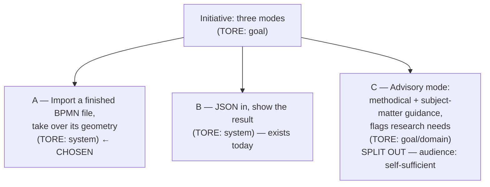

# Import mode — take over existing geometry instead of recomputing it

> SoT of the "three modes" initiative. This record describes **one** slice (A).
> B already exists, C has been split out (its own record) — see Split.

## Review view

> Derived view — **not** a new source of truth, **not** a seal of approval. **Open
> items first**, no traffic lights, every number links to its evidence in the record.

| Review goal | Status (open → substantiated) | → Evidence |
|---|---|---|
| **Restraint** (what's open?) | **1 open decision** (id-vs-name matching, "measure first") — origin/negative coordinates settled live in bpmn.io on 2026-07-28 · **1 slice split out** (C — parking reason resolved, audience decided, own record created, `raw`) — all with trigger and owner | ↓ Open items · Split |
| **Coverage** (pillars + forgotten paths) | **7 of 7 pillars** addressed · **3 justified opt-outs** (performance target · `regulatory_refs` · rollout plan) · **Negation axis applied:** 8 paths, 7 dispositioned as scenarios, 1 open | ↓ Pillars · F4 |
| **Substantiation** (sources) | **~20 Verified** (code measurement or primary source) · **1 Hypothesis** (the LLM path is not a loss case) · **1 hypothesis substantiated live** (bpmn.io/origin) · **1 correction** from user feedback (AI Hub connectivity) | ↓ Pillar sources · Change log |
| **Test penetration** (testable) | **0 scenarios formalized** — Phase 4 still open. 7 candidates are ready from the negation axis; the success criterion is stated measurably (100% round trip, current baseline 0/8) | ↓ Acceptance criteria · F4 |
| **Integrity** (process) | GATE 1 **passed** (2026-07-28) · GATE 2a/2b **pending** · Change log has 5 entries | ↓ Change log |

## Origin

- **Source:** Working session 2026-07-28, dialogue following the layout hardening
  (PR #29). No external document — synthesized from the conversation.
- **Verbatim original (audit anchor, NEVER overwritten):**
  > (verbatim, German — audit anchor, never rewritten)
  >
  > „aber das json muss natürlich auch gut dokumentiert sein.
  > eigentlich brauchen wir drei modi. ich will ein bpmn diagramm so haben und alle
  > informationen inklusive koordinaten werden übernommen, dann ein hier hast du eine
  > json zeig mir mal dein ergebnis und ein modus wo man sagt ich habe keine ahnung von
  > prozessen aber ich hoffe ich weiß wie es ungefähr läuft und beraten wird methodisch
  > und fachlich"
  >
  > „oder darauf hingewiesen, dass man fachlich recherchieren soll."
  >
  > „und ein modus von importieren wir eine fertige bpmn logischerweise auch"
  >
  > „vielleicht als mapping von xml auf json. berate michd a mal"

- **Canonical formulation:** The generator should be able to import a finished BPMN
  file and take over its existing diagram geometry (shape bounds, edge waypoints,
  label positions) instead of recomputing it. How the imported geometry is handled
  must be chosen explicitly at call time; there is no silent guessing.

- **Rationale (approved at GATE 1, 2026-07-28 — binding basis):**
  Whoever brings a finished BPMN file has already made a layout decision — often
  deliberately, and often agreed among several stakeholders. Discarding it makes the
  tool useless for analysing foreign models: the result is no longer recognisable, and
  comparison against the original becomes impossible. At the same time, discarding it
  is sometimes exactly what's wanted (redesign). Both intents are legitimate, neither
  is the default — which is why the intent has to be named explicitly.

## Current state (measured 2026-07-28, branch `fix/layout-collaboration-haertung`)

| Finding | Status | Source |
|---|---|---|
| The round trip BPMN → Logic-Core → BPMN retains **0 of 8** shape positions | Verified | Measured against `tests/fixtures/simple-approval.expected.bpmn`; example: Participant `(20,20)` → `(0,0)`, `task1` `(256,220)` → `(236,200)` |
| `import.js` reads `BPMNShape` but uses **only** the `bioc:` colours from it | Verified | `scripts/import.js:189-204` |
| The Logic-Core has **no** coordinate field | Verified | `references/input-schema.json` — none of the 9 `$defs` carries x/y/width/height/waypoints |

The loss is therefore not a parser weakness but a property of the contract: there is
no way to **put** geometry in — only to have it generated.

## Split / slices

The initiative from the verbatim original spans three levels and is therefore
split-mandatory. **A** is chosen; B is today's state, C has been split out.

- **A — chosen.** Well scoped, measurable against the code (round-trip rate), closes
  the last gap in the geometry contract.
- **B — exists.** Today's default path; no action needed from this record.
- **C — still not in this record, but its parking reason is resolved (2026-07-28).**
  The trigger was: self-sufficient or assistive? **Decided: self-sufficient** — the
  subject-matter expert describes their own work, nobody is sitting next to them. That
  means C needs a substantiated elicitation methodology with guardrails, not just
  better prompting.
  Consequence: C has its **own record** —
  `docs/anforderungen/2026-07-28_beratender-modus.md` (`reifegrad: raw`). Owner:
  daniel.stiegler.

  *Insight from the dialogue (lowers the effort considerably):* The methodology does
  not need to be invented. `anforderungs-denkrahmen` is already the template — pillars
  with a mandatory opt-out map onto fixed elicitation dimensions (trigger · roles ·
  outcome · exceptions · deadlines · systems · decisions); the negation axis maps onto
  "what prevents, negates, interrupts this?"; necessity maps onto "no step without
  confirmation from the human"; the status classes `Verified`/`Hypothesis`/`Not found`
  map onto **derivable** (structure) / **askable** (the human knows) / **needs
  research** ("I cannot know this"). The user's wish to be "pointed to a need for
  subject-matter research" is therefore not an extra feature but the third status
  class, surfaced to the end user instead of the developer.

## Prior decisions from the dialogue

Two decisions were made in conversation before this record existed. They stand as
constraints, not findings — and are checked for necessity in Phase 2 (necessity,
denkrahmen §6b):

1. **The Logic-Core stays coordinate-free.** The geometry comes as a second document
   alongside it (a serialised `coordMap`). Rationale from the dialogue: CLAUDE.md
   states as a founding principle "The LLM NEVER touches coordinates"; a coordinate
   field in the schema would sooner or later end up in a few-shot example and invite
   the language model to invent coordinates.
2. **The layout switch is a required parameter with no default.** Rationale:
   analysing ("inspect a foreign model, leave the picture untouched") and evolving
   ("extend what's there") are equally important; a default would silently favour one
   of the two intents.

## Pillars

### business_intent — `prioritaet: muss`

**Finding.** The goal is to be able to take in existing model landscapes, not just
generate new ones. Whoever hands over a finished BPMN file for review must get it
back recognisable — otherwise neither a comparison against the original nor any
statement about *this* diagram is possible.

**Justification for the priority level (muss/must, confirmed at GATE 1 in the
dialogue on 2026-07-28):** In public-sector agencies the existing stock is already in
BPMN. A tool that can only generate and not ingest sits outside that landscape. Import
is therefore the entry ticket, not a convenience.

**Success criterion (measurable):** With `preserve`, **100%** of shape positions and
edge waypoints survive the round trip BPMN → import → generation. Current baseline:
**0 of 8** (see Current state).

| Status | Source |
|---|---|
| Verified (baseline) | Measured against `tests/fixtures/simple-approval.expected.bpmn`, 2026-07-28 |
| Decision (priority level) | Dialogue 2026-07-28, GATE 1 |

### user_ux

**Actors.** Three call paths, all already present: CLI (`node import.js`), MCP
(`import_bpmn`), HTTP (`/api/v1/import`). The role is the same in every case: someone
bringing a foreign or their own BPMN file into the tool chain — not the subject-matter
expert describing a process (that's slice C).

**Finding (decision, dialogue 2026-07-28).** Import delivers **two files side by
side**: `out.json` (Logic-Core, unchanged and schema-valid) and `out.geometry.json`.
This keeps the Logic-Core directly usable as pipeline input, and the schema gate
applies unchanged.

**Requirement on the pair (user, dialogue 2026-07-28):** *"but they must be kept in
sync with each other"*. The two files must not simply sit side by side — their
correspondence must be **checkable**. A geometry file that belongs to a different or
stale Logic-Core is more dangerous than none at all: it produces a picture that looks
plausible and shows the wrong model. Design and behaviour on mismatch: see the
`functional` pillar.

| Status | Source |
|---|---|
| Decision | Dialogue 2026-07-28 |
| Verified (call paths exist) | `scripts/import.js`, `scripts/mcp-bpmn-server.js` (`import_bpmn`), `scripts/http-server.js` |

### functional

#### F1 — Mapping BPMN DI → geometry document

The mapping is mechanical, because `coordMap` already mirrors the DI structure.

| BPMN DI | Geometry document | Note |
|---|---|---|
| `BPMNShape[bpmnElement=<node>]` → `dc:Bounds` | `coords[<id>] = {x,y,w,h}` | Nodes, boundary events, artifacts |
| `BPMNShape[bpmnElement=<lane>]` | `laneCoords[<id>]` | `isHorizontal` is read but not evaluated (only horizontal is supported) |
| `BPMNShape[bpmnElement=Participant_*]` | `poolCoords[<poolId>]` | The `Participant_` prefix is stripped |
| `BPMNEdge` → `di:waypoint*` | `edgeCoords[<id>] = [{x,y}…]` | Sequence flows, message flows, associations |
| `BPMNLabel` → `dc:Bounds` | `edgeLabels[<id>] = {text,x,y}` | Edges only; node labels follow from the shape |

**Not mapped, deliberately discarded:** `BPMNPlane` metadata, `bioc:` colours (those
still go into the Logic-Core, `node.color` — existing behaviour), `BPMNLabelStyle`,
vendor-specific extensions.

#### F2 — The layout switch (required parameter, no default)

| Value | Existing geometry | Element without geometry |
|---|---|---|
| `preserve` | taken over | **stays without** — the gap is preserved, not filled |
| `fill-gaps` | taken over | gets **placed** (layout runs only for what's missing) |
| `regenerate` | **discarded** | gets placed (today's behaviour) |

Decision from the dialogue on 2026-07-28: *"fill it or don't, depending on the mode"*
— the switch is exactly that distinguishing feature. Without a strict `preserve` the
success criterion (100% round trip) would not be measurable, because silently filling
gaps would paper over every deviation.

**If the parameter is missing, the call aborts** — no guessing. Grounded in "Prior
decisions": analysing and evolving are equally ranked.

#### F3 — Keeping the two files in sync

The geometry document carries the id of its associated Logic-Core and a checksum as a
**hint**. Binding happens **per element, by id** — that's how `coordMap` is built
anyway. On load, the following is reported:

- Elements in the Logic-Core **without** geometry → depends on the switch (F2)
- Geometry **without** a matching element in the Logic-Core → discarded, reported by
  name
- Mismatched checksum → warning, **no** abort

Decision from the dialogue on 2026-07-28. A whole-document checksum with a hard
rejection was rejected, because it makes `fill-gaps` practically impossible: renaming
a single task would devalue the entire geometry, even though almost everything else
still applies.

#### F4 — Negation axis (what prevents, negates, interrupts?)

| Path | Disposition |
|---|---|
| File not parseable / not BPMN | Abort with location — **scenario** |
| BPMN **without any** DI (semantics only) | behaves like `regenerate`, with a note — **scenario** |
| DI references an unknown element | Geometry discarded, reported (F3) — **scenario** |
| Element in the Logic-Core without geometry | depends on the switch (F2) — **scenario** |
| Switch missing | Abort (F2) — **scenario** |
| Checksum mismatch | Warning, run continues (F3) — **scenario** |
| Foreign DI is internally broken (overlapping pools etc.) | gets **taken over** and reported by the DI check — **scenario** |
| Negative coordinates in the original | **open** — see Open items |

| Status | Source |
|---|---|
| Verified (mapping is possible) | `scripts/coordinates.js` (`coordMap` structure), `scripts/bpmn-xml.js` (DI generation, same fields) |
| Decision (F2, F3) | Dialogue 2026-07-28 |

### quality_attributes

With this requirement, import moves from a side path to a product path — foreign
files become a regular entry point. That shifts the robustness question.

| Finding | Status | Source |
|---|---|---|
| **No XXE, no entity expansion — by construction.** `import.js` uses a hand-written recursive parser (`parseXml` → `parseElement`) with no entity handling at all. There is nothing to expand, hence no billion-laughs class either. | Verified | `scripts/import.js`, `parseXml`/`parseElement`; no `DOCTYPE`/`ENTITY` handling in the module |
| **Stack-bounded.** With very deep nesting the parser aborts with a `RangeError`. Measured: 500 ✓, 2,000 ✓, 10,000 → `RangeError`. A real BPMN file never reaches that depth. | Verified | Measured 2026-07-28 |
| The error does not surface as an uncaught 500 — the HTTP handler wraps the endpoints. | Verified | `scripts/http-server.js:225-399` |
| Input size is capped at 10 MB, rate limit 30/min. | Verified | `CLAUDE.md` → Security defaults; `scripts/http-server.js` |

**Opt-out: performance target.** No throughput/latency target set. Rationale: import
is a single-shot operation at a desk, not a bulk path; the largest real case so far
(45 nodes, 6 participants) completes, generation included, in under five seconds. A
target with no observed problem would be invented (denkrahmen §6b).

### compliance

**Finding.** The generator does not process personal data *on its own* — but
**imported** BPMN files can contain it: lanes carry role names and often personal
names, labels can reference individual cases. Import makes the tool a recipient of
foreign content for the first time.

| Finding | Status | Source |
|---|---|---|
| The audit log writes **metadata only** (event, correlation id, client id, endpoint, duration) — **no** model content. Imported content therefore never reaches the log. | Verified | `scripts/http-server.js:288-293`, `scripts/audit.js` |
| No new storage location is created: output goes wherever the caller writes it. | Verified | `scripts/import.js` (the CLI writes to the given path) |

**`regulatory_refs: []` — justified opt-out.** No VVG/VAG/IDD/MaRisk obligation: the
tool is not an insurance system and makes no substantive decisions. GDPR relevance
only arises indirectly, through the content of imported files, and rests with the
operator, not the tool — it stores nothing on its own and logs no content. Should
import ever feed into a service with persistent storage, this opt-out needs
re-evaluating.

### architecture

| Finding | Status | Source |
|---|---|---|
| The geometry contract has so far been **one-directional**: `coordMap` is only ever produced, never accepted. This requirement turns it into a two-way contract. | Verified | `scripts/pipeline.js` — `buildCoordinateMap(elkResult, lc)` is the only source |
| The DI check runs on `coordMap` and is therefore applicable to imported geometry **without any change** — the guard becomes an inspection report over foreign models. | Verified | `scripts/di-check.js` (`checkDiagramIntegrity(coordMap, lc)`) |
| A second import path, `moddle-import.js` (bpmn-moddle), exists in parallel. It has to produce the same mapping, or the two paths drift apart — the same failure class as the two renderers. | Verified (existence) | `scripts/moddle-import.js` |

**System boundary.** No new dependency. No ADR needed: the architectural decision
("the Logic-Core stays coordinate-free, geometry sits alongside it") is recorded in
this document and already anchored in `CLAUDE.md` under "The geometry contract".

### migration_operations

| Finding | Status | Source |
|---|---|---|
| **Backward compatible.** Without a geometry document everything behaves as today; the required switch only kicks in *when* geometry is passed. Existing calls to `runPipeline`, MCP and HTTP remain valid. | Decision | Dialogue 2026-07-28 |
| No data migration: there is no existing stock of geometry documents. | Verified | The format does not exist yet |
| Rollback: a pure addition; a revert removes it completely. | Decision | — |

**Opt-out: rollout plan.** No staged rollout needed — there is no live operation with
users who could be broken by this.

## Comparison — how other tools solve this

Researched 2026-07-28. The question of separating model from layout is not new; there
is a close precedent.

### Structurizr (C4 modelling) — the same split, in production for years

| Finding | Status | Source |
|---|---|---|
| Layout is **not** kept in the authored source: *"element x,y positions are not stored in the source of your workspace… This information is instead stored in a JSON version of your workspace"* (`workspace.json`). Exactly our split. | Verified | [docs.structurizr.com/ui/diagrams/manual-layout](https://docs.structurizr.com/ui/diagrams/manual-layout) |
| When the model is regenerated, the layout is **merged in**, not written alongside it — via a pluggable merge algorithm. Matches our per-element binding (F3). | Verified | ibid. |
| **Matching is primarily by NAME**, falling back to the internal id for renamed elements. | Verified | ibid. |
| Documented loss case: *"If you rename an element and change the creation order… the element can't be matched, and manual layout information for that element will be lost."* | Verified | ibid. |
| A second loss case: unstable view keys — *"automatically generated view keys are not guaranteed to be stable over time, and you will likely lose manual layout information"*. Recommendation: set keys explicitly. | Verified | ibid. |

**What this means for us.** The architectural decision is backed by a mature tool. But
the loss case is documented too — and it hits us at the same spot: **our id-only
binding only holds as long as the ids are stable.** On import from BPMN they are (they
come from the source file). As soon as a language model regenerates the Logic-Core,
they aren't — and the geometry is silently lost. Structurizr's answer is the
name-then-id fallback strategy. See Open items.

### bpmn.io / bpmn-js — the DI *is* the model

| Finding | Status | Source |
|---|---|---|
| Import runs in two stages: XML → moddle objects, then rendering from `BPMNPlane`/`BPMNShape`/`BPMNEdge`. The DI is read and *is* the geometry source — there is no second layout document, because there is no second model. | Verified | [deepwiki.com/bpmn-io/bpmn-js — Import and Export](https://deepwiki.com/bpmn-io/bpmn-js/6-import-and-export) |
| For files **without** DI, the ecosystem points to `bpmn-auto-layout`, which generates the missing DI. Exactly the role of our `regenerate` and `fill-gaps`. | Verified | ibid.; [bpmn.io/toolkit/bpmn-js](https://bpmn.io/toolkit/bpmn-js/) |

**What this means for us.** Our three-value switch does not name a special case; it
names the three states the ecosystem already recognises: DI present (take over), DI
partial (fill in), DI missing or unwanted (generate). bpmn.io doesn't need the switch
because it only ever knows one state — there, the DI *is* the model. We need it
because we have two models.

## Open items

- ~~**Origin / negative coordinates.**~~ **Decided 2026-07-28: keep unchanged and
  report** (variant 3). Both pieces of evidence are in:
  - *Verified:* Our SVG renderer normalises the view itself (`scripts/svg.js`,
    `minX`/`minY`); a file with 27 negative x values passes through and produces an
    SVG with no negative values.
  - *Verified (2026-07-28, measured live):* bpmn.io renders negative coordinates
    correctly, unchanged. A `simple-approval` variant with all coordinates shifted by
    -2000/-1480 was loaded in demo.bpmn.io: 20 elements, 13 of them with negative
    coordinates, display fully normal. The viewbox simply follows the content
    (`{x: -1980, y: -1480, …}`). The earlier hypothesis is thereby substantiated — the
    origin is irrelevant to bpmn.io, and the 100% round trip remains achievable.
- **Matching strategy (id vs. name).** Structurizr matches primarily by name, id as a
  fallback, and documents the loss case on renaming. We decided id-only. Resolution
  2026-07-28: **measure first, then decide.** Two of the three paths that rewrite the
  Logic-Core are now substantiated:
  - *Verified:* Import from BPMN — ids come from the source file, stable by
    construction (`scripts/import.js`).
  - *Verified:* The redesign toolbox — `nextId` is used **exclusively** for new
    elements; **no** assignment to `.id` of an existing node anywhere in
    `scripts/redesign.js` / `scripts/redesign-core.js`. Existing ids are preserved.
  - *Not measured:* LLM regeneration from prose. **Not for lack of a provider** — the
    adesso AI Hub is connected on this machine, and the sovereign models
    (`qwen-3.6-35b-sovereign`, `gemma-4-26b-sovereign`) are free and unaffected by the
    budget stop on the paid models. `scripts/agents/llm-provider.js` is
    OpenAI-compatible (`createLlmProvider({baseUrl, apiKey, model})`) and can talk to
    it directly. Only this working session is blocked:
    `ADESSO_AI_HUB_API_KEY` / `ADESSO_AI_HUB_BASE_URL` are not set in its environment.
    **Trigger:** export the key, then run the modeler agent twice on the same text and
    measure the id overlap. **Owner:** daniel.stiegler.
  - *Hypothesis for context:* The LLM path is presumably not a loss case, because it
    produces a **new** model there and `regenerate` is the appropriate switch.
    Structurizr re-runs the same DSL — deterministic authoring, not generation. The
    two cases are not the same.
- Rationale not yet approved (GATE 1).
- Slice C split out to `docs/anforderungen/2026-07-28_beratender-modus.md` (`raw`):
  audience decided, three open questions parked there.

## Acceptance criteria

_(Phase 4 — not yet addressed.)_

## Change log

- 2026-07-28 · MATURITY · Record · — → raw · Working session 2026-07-28
- 2026-07-28 · ADDITION · functional · F1–F4 added (mapping, switch, sync, negation axis) · Dialogue
- 2026-07-28 · ADDITION · Comparison · Structurizr + bpmn.io substantiated as precedent · docs.structurizr.com, deepwiki bpmn-js
- 2026-07-28 · CORRECTION · Open items / Matching · "no LLM provider configured" → wrong: the adesso AI Hub is connected, sovereign models are free; only this session's environment lacks the key · User feedback, checked against `~/.claude/skills/deep-research-sovereign/SKILL.md` and the AI Hub model catalogue
- 2026-07-28 · ADDITION · Split / slice C · Parking reason resolved: audience = self-sufficient (subject-matter expert without company); the methodology template is `anforderungs-denkrahmen`, not a new build · Dialogue
- 2026-07-28 · REFINEMENT · Open items / Origin · Hypothesis → Verified: bpmn.io renders negative coordinates correctly, viewbox follows the content · Live measurement in demo.bpmn.io
- 2026-07-28 · MATURITY · Record · raw → structured → enriched · GATE 1 passed (rationale approved)
- 2026-07-28 · REFINEMENT · Open items / Matching · Id stability verified for the import and redesign paths; only the LLM path remains open · `scripts/redesign.js`, `scripts/redesign-core.js` (no `.id =` on an existing node)
